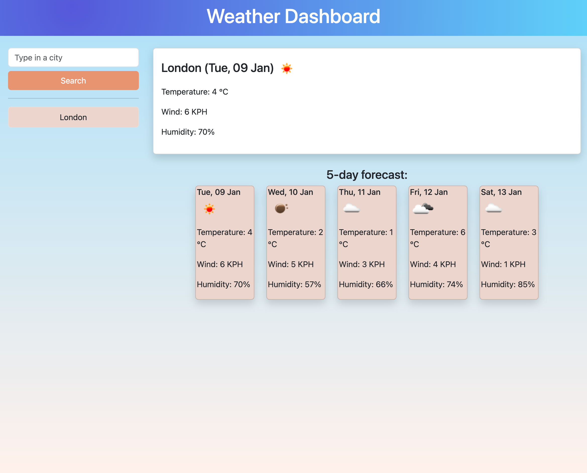
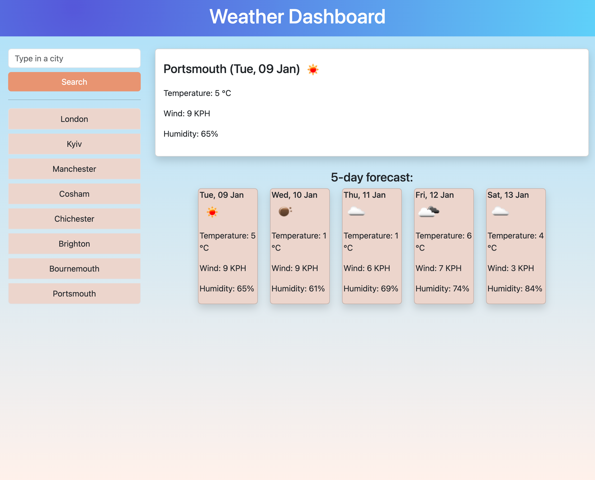

# Weather Dashboard

## Description
This is the solution for the challenge from EdX bootcamp, Week 8, Day 4.
During Week 8 at the bootcamp, I learnt Learn how to send, receive, and manipulate data from external sources using modern web-based protocols (I particularly delved into accessing data on RESTful web APIs using
AJAX calls, processing return data to isolate key elements for JavaScript logic, generating page elements based on API
responses). 

And my this week challenge was to build a weather dashboard that will run in the browser and feature dynamically updated HTML and CSS.

## User Story 

- AS A traveler
- I WANT to see the weather outlook for multiple cities
- SO THAT I can plan a trip accordingly

## Acceptance Criteria
The criteria I need to take into account are the following:

- Create a weather dashboard with form inputs.
  - When a user searches for a city they are presented with current and future conditions for that city and that city is added to the search history
  - When a user views the current weather conditions for that city they are presented with:
    - The city name
    - The date
    - An icon representation of weather conditions
    - The temperature
    - The humidity
    - The wind speed
  - When a user view future weather conditions for that city they are presented with a 5-day forecast that displays:
    - The date
    - An icon representation of weather conditions
    - The temperature
    - The humidity
  - When a user click on a city in the search history they are again presented with current and future conditions for that city
 
## A link to the deployed application
https://yuzbamaria.github.io/Weather_Dashboard/ 

## Screenshots of the application

## License 
MIT License

